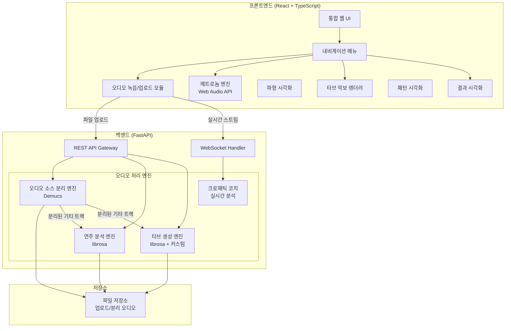
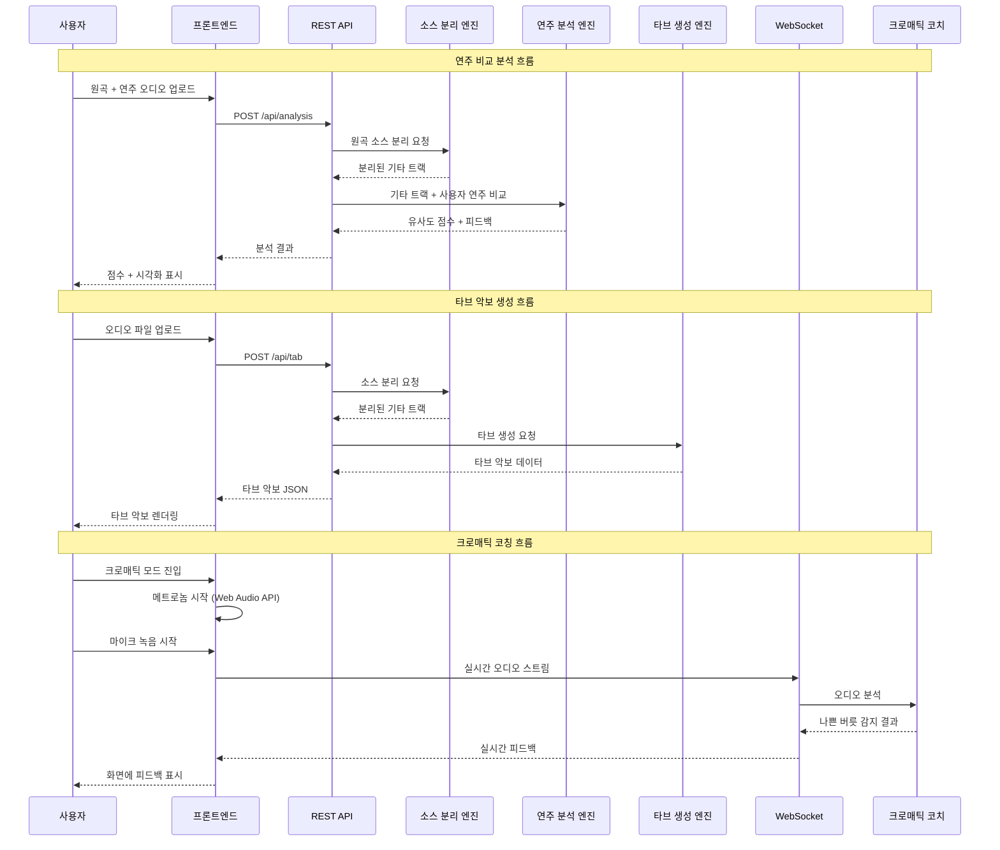

# 기술 설계 문서: Guitar Practice Hub

## 개요 (Overview)

Guitar Practice Hub는 기타 학습자를 위한 올인원 웹 애플리케이션으로, 네 가지 핵심 기능을 단일 플랫폼에서 제공합니다:

1. **오디오 소스 분리**: 혼합 음원에서 기타 트랙을 자동 분리
2. **연주 비교 분석**: 분리된 기타 트랙과 사용자 연주를 비교하여 유사도 점수 및 피드백 제공
3. **타브 악보 생성**: 분리된 기타 트랙에서 자동으로 타브 악보 생성
4. **크로매틱 코칭**: 메트로놈, 연습 패턴, 나쁜 버릇 실시간 식별

### 기술 스택 결정

| 영역 | 기술 | 근거 |
|------|------|------|
| 프론트엔드 | React + TypeScript | 컴포넌트 기반 UI, 타입 안전성, Web Audio API 통합 용이 |
| 백엔드 | Python (FastAPI) | 오디오 처리 라이브러리(librosa, demucs) 생태계 풍부 |
| 오디오 소스 분리 | Demucs (Meta) | 최신 딥러닝 기반 소스 분리, 4-stem 분리 지원 |
| 오디오 분석 | librosa, numpy | 피치 감지, 온셋 감지, 스펙트럼 분석 표준 라이브러리 |
| 실시간 오디오 | Web Audio API | 브라우저 내 메트로놈 재생, 실시간 오디오 캡처 |
| 파일 저장 | 로컬 파일 시스템 / S3 | 업로드 및 분리된 오디오 파일 임시 저장 |
| 통신 | REST API + WebSocket | REST: 파일 업로드/분석 요청, WebSocket: 실시간 크로매틱 코칭 |

---

## 아키텍처 (Architecture)

### 시스템 아키텍처 다이어그램



### 데이터 흐름 다이어그램



### 설계 결정 사항

1. **메트로놈은 프론트엔드에서 처리**: Web Audio API의 `AudioContext`를 사용하여 정밀한 타이밍(±5ms)을 보장합니다. 서버 왕복 지연을 피하기 위해 클라이언트 사이드에서 직접 처리합니다.

2. **소스 분리는 백엔드에서 처리**: Demucs 모델은 GPU 가속이 필요한 딥러닝 모델이므로 서버에서 실행합니다.

3. **크로매틱 코칭은 WebSocket 사용**: 실시간 오디오 스트리밍과 즉각적인 피드백(500ms 이내)을 위해 WebSocket을 사용합니다.

4. **소스 분리 결과 캐싱**: 동일 파일에 대한 중복 분리를 방지하기 위해 파일 해시 기반 캐싱을 적용합니다.

---

## 컴포넌트 및 인터페이스 (Components and Interfaces)

### 프론트엔드 컴포넌트

#### 1. AudioInputModule (오디오 입력 모듈)
- **역할**: 마이크 녹음 및 파일 업로드 처리
- **인터페이스**:
  - `startRecording(): Promise<void>` — 마이크 접근 권한 요청 후 녹음 시작
  - `stopRecording(): AudioBlob` — 녹음 중지, WAV 형식 반환
  - `uploadFile(file: File): Promise<ValidationResult>` — 파일 형식/크기 검증 후 업로드
  - `validateFile(file: File): ValidationResult` — MP3/WAV 형식, 50MB 이하 검증

#### 2. MetronomeEngine (메트로놈 엔진)
- **역할**: Web Audio API 기반 정밀 메트로놈
- **인터페이스**:
  - `start(bpm: number): void` — 메트로놈 시작 (40-240 BPM)
  - `stop(): void` — 메트로놈 정지
  - `setBpm(bpm: number): void` — BPM 변경
  - `isPlaying(): boolean` — 재생 상태 확인
- **구현 세부사항**: `AudioContext.currentTime` 기반 스케줄링으로 ±5ms 정밀도 보장. look-ahead 스케줄링 패턴 사용.

#### 3. TabRenderer (타브 악보 렌더러)
- **역할**: 타브 악보 데이터를 시각적으로 렌더링
- **인터페이스**:
  - `render(tabData: TabData): ReactElement` — 타브 악보 시각화
  - `exportAsText(tabData: TabData): string` — 텍스트 형식 내보내기

#### 4. PatternVisualizer (패턴 시각화)
- **역할**: 크로매틱 패턴을 프렛보드 다이어그램으로 표시
- **인터페이스**:
  - `displayPattern(pattern: ChromaticPattern): void` — 패턴 다이어그램 표시
  - `highlightCurrentPosition(position: FretPosition): void` — 현재 연주 위치 강조

#### 5. ResultVisualizer (결과 시각화)
- **역할**: 분석 결과 및 비교 시각화
- **인터페이스**:
  - `displayScores(result: AnalysisResult): void` — 점수 표시
  - `displayTimeline(comparison: TimelineComparison): void` — 시간축 비교 시각화
  - `displayBadHabitReport(report: BadHabitReport): void` — 나쁜 버릇 리포트 표시

### 백엔드 컴포넌트

#### 1. AudioSourceSeparationEngine (오디오 소스 분리 엔진)
- **역할**: Demucs 기반 혼합 오디오 소스 분리
- **인터페이스**:
  - `POST /api/separation` — 오디오 파일 업로드 및 소스 분리 요청
    - Request: `multipart/form-data` (audio file)
    - Response: `{ taskId: string, status: string }`
  - `GET /api/separation/{taskId}` — 분리 결과 조회
    - Response: `{ status: string, guitarTrackUrl?: string, waveformData?: number[] }`
- **내부 메서드**:
  - `separate(audioPath: str) -> SeparationResult` — Demucs 모델로 4-stem 분리
  - `extractGuitarTrack(separationResult) -> str` — 기타 트랙 WAV 파일 경로 반환

#### 2. PerformanceAnalysisEngine (연주 분석 엔진)
- **역할**: 기타 트랙과 사용자 연주 비교 분석
- **인터페이스**:
  - `POST /api/analysis` — 원곡 + 연주 오디오 업로드 및 분석 요청
    - Request: `multipart/form-data` (original audio, user audio)
    - Response: `{ taskId: string }`
  - `GET /api/analysis/{taskId}` — 분석 결과 조회
    - Response: `AnalysisResult`
- **내부 메서드**:
  - `analyzePitch(reference: ndarray, user: ndarray) -> int` — 피치 정확도 (0-100)
  - `analyzeRhythm(reference: ndarray, user: ndarray) -> int` — 리듬 정확도 (0-100)
  - `analyzeTiming(reference: ndarray, user: ndarray) -> int` — 타이밍 일치도 (0-100)
  - `calculateOverallScore(pitch, rhythm, timing) -> int` — 전체 유사도 점수
  - `identifyDifferentSections(reference, user) -> list[Section]` — 차이 구간 식별

#### 3. TabGenerationEngine (타브 생성 엔진)
- **역할**: 기타 트랙에서 타브 악보 생성
- **인터페이스**:
  - `POST /api/tab` — 오디오 파일 업로드 및 타브 생성 요청
    - Request: `multipart/form-data` (audio file)
    - Response: `{ taskId: string }`
  - `GET /api/tab/{taskId}` — 타브 생성 결과 조회
    - Response: `TabData`
- **내부 메서드**:
  - `detectNotes(audioPath: str) -> list[DetectedNote]` — 피치/온셋 감지
  - `mapToFretboard(notes: list[DetectedNote]) -> list[TabNote]` — 프렛보드 매핑
  - `generateTab(tabNotes: list[TabNote]) -> TabData` — 타브 데이터 생성

#### 4. TabFormatter (타브 악보 포맷터)
- **역할**: 구조화된 타브 데이터를 텍스트 기반 타브 악보 문자열로 변환 및 파싱
- **인터페이스**:
  - `formatToText(tabData: TabData) -> str` — 타브 데이터를 텍스트 문자열로 변환
  - `parseFromText(tabText: str) -> TabData` — 텍스트 타브 악보를 구조화된 데이터로 파싱
- **라운드트립 보장**: `parseFromText(formatToText(tabData)) == tabData`

#### 5. ChromaticCoach (크로매틱 코치)
- **역할**: 실시간 크로매틱 연습 코칭
- **인터페이스**:
  - WebSocket `/ws/chromatic`
    - Client → Server: 실시간 오디오 청크 (PCM 데이터)
    - Server → Client: `BadHabitDetection` 이벤트
  - `POST /api/chromatic/session/start` — 세션 시작
    - Request: `{ bpm: number, pattern: string }`
    - Response: `{ sessionId: string }`
  - `POST /api/chromatic/session/{sessionId}/stop` — 세션 종료
    - Response: `BadHabitReport`
- **내부 메서드**:
  - `detectPickScratch(spectrum: ndarray) -> bool` — 피크 비빔 감지 (고주파 잡음 > 15%)
  - `detectMuteFail(spectrum: ndarray, targetString: int) -> bool` — 뮤트 실패 감지 (-40dB 초과)
  - `detectTimingDeviation(onsetTime: float, expectedTime: float, beatInterval: float) -> bool` — 박자 이탈 감지 (20% 초과)
  - `detectLeftHandDelay(noteIntervals: list[float], expectedInterval: float) -> bool` — 왼손 지연 감지 (30% 초과)
  - `generateReport(session: Session) -> BadHabitReport` — 요약 리포트 생성

### BPM 유효성 검증 유틸리티

- `validateBpm(bpm: number) -> ValidationResult` — BPM 범위 검증 (40-240)
- `bpmToIntervalMs(bpm: number) -> number` — BPM을 밀리초 간격으로 변환
  - 공식: `interval = 60000 / bpm`
  - 라운드트립: `bpmToIntervalMs(intervalMsToBpm(ms)) ≈ ms` (부동소수점 허용 오차 내)

---

## 데이터 모델 (Data Models)

### 프론트엔드 타입 정의 (TypeScript)

```typescript
// 오디오 입력 관련
interface ValidationResult {
  valid: boolean;
  error?: string;
}

// 분석 결과
interface AnalysisResult {
  overallScore: number;        // 0-100
  pitchScore: number;          // 0-100
  rhythmScore: number;         // 0-100
  timingScore: number;         // 0-100
  differentSections: Section[];
}

interface Section {
  startTime: number;  // 초 단위
  endTime: number;    // 초 단위
}

// 타브 악보
interface TabData {
  notes: TabNote[];
  tuning: string[];  // ["E", "A", "D", "G", "B", "E"]
}

interface TabNote {
  time: number;       // 시작 시간 (초)
  string: number;     // 줄 번호 (1-6, 1=고음 E)
  fret: number;       // 프렛 번호 (0-24)
}

// 크로매틱 연습
interface ChromaticPattern {
  id: string;
  name: string;
  fretSequence: number[];      // 예: [1, 2, 3, 4]
  stringDirection: 'ascending' | 'descending';
}

interface FretPosition {
  string: number;  // 줄 번호
  fret: number;    // 프렛 번호
}

// 나쁜 버릇
type BadHabitType = 'pick_scratch' | 'mute_fail' | 'timing_off' | 'left_hand_delay';

interface BadHabitDetection {
  type: BadHabitType;
  timestamp: number;       // 발생 시점 (초)
  position: FretPosition;  // 발생 위치
  details: string;         // 상세 설명
}

interface BadHabitReport {
  sessionId: string;
  totalNotes: number;
  habits: BadHabitSummary[];
  mostFrequentSection?: {
    startTime: number;
    endTime: number;
  };
}

interface BadHabitSummary {
  type: BadHabitType;
  count: number;
  ratio: number;  // 전체 음 대비 발생 비율 (0-1)
}

// 메트로놈
interface MetronomeConfig {
  bpm: number;  // 40-240
}
```

### 백엔드 데이터 모델 (Python)

```python
from pydantic import BaseModel, Field
from enum import Enum
from typing import Optional

class SeparationResult(BaseModel):
    task_id: str
    status: str  # "processing", "completed", "failed"
    guitar_track_path: Optional[str] = None
    error_message: Optional[str] = None

class DetectedNote(BaseModel):
    time: float          # 시작 시간 (초)
    frequency: float     # Hz
    duration: float      # 지속 시간 (초)
    amplitude: float     # 음량

class TabNote(BaseModel):
    time: float
    string_num: int = Field(ge=1, le=6)
    fret: int = Field(ge=0, le=24)

class TabData(BaseModel):
    notes: list[TabNote]
    tuning: list[str] = ["E", "A", "D", "G", "B", "E"]

class AnalysisResult(BaseModel):
    overall_score: int = Field(ge=0, le=100)
    pitch_score: int = Field(ge=0, le=100)
    rhythm_score: int = Field(ge=0, le=100)
    timing_score: int = Field(ge=0, le=100)
    different_sections: list[dict]  # [{start_time, end_time}]

class BadHabitType(str, Enum):
    PICK_SCRATCH = "pick_scratch"
    MUTE_FAIL = "mute_fail"
    TIMING_OFF = "timing_off"
    LEFT_HAND_DELAY = "left_hand_delay"

class BadHabitDetection(BaseModel):
    type: BadHabitType
    timestamp: float
    string_num: int
    fret: int
    details: str

class BadHabitSummary(BaseModel):
    type: BadHabitType
    count: int
    ratio: float = Field(ge=0.0, le=1.0)

class BadHabitReport(BaseModel):
    session_id: str
    total_notes: int
    habits: list[BadHabitSummary]
    most_frequent_section: Optional[dict] = None  # {start_time, end_time}
```

---

## 정확성 속성 (Correctness Properties)

*속성(Property)은 시스템의 모든 유효한 실행에서 참이어야 하는 특성 또는 동작입니다. 속성은 사람이 읽을 수 있는 명세와 기계가 검증할 수 있는 정확성 보장 사이의 다리 역할을 합니다.*

### Property 1: 파일 형식 검증 일관성

*For any* 파일에 대해, 파일 확장자가 MP3 또는 WAV이면 검증이 통과하고, 그 외의 확장자이면 검증이 실패하여 오류 메시지를 반환해야 한다.

**Validates: Requirements 2.3, 2.4**

### Property 2: 파일 크기 검증

*For any* 파일에 대해, 파일 크기가 50MB 이하이면 크기 검증이 통과하고, 50MB를 초과하면 검증이 실패하여 오류 메시지를 반환해야 한다.

**Validates: Requirements 2.5**

### Property 3: 분리된 기타 트랙 WAV 형식 보장

*For any* 성공적으로 완료된 소스 분리 결과에 대해, 출력된 기타 트랙 파일은 유효한 WAV 형식이어야 한다.

**Validates: Requirements 3.5**

### Property 4: 분석 점수 범위 불변 조건

*For any* 연주 분석 결과에 대해, 전체 유사도 점수, 피치 정확도, 리듬 정확도, 타이밍 일치도는 모두 0 이상 100 이하의 정수여야 한다.

**Validates: Requirements 4.2, 4.3**

### Property 5: 차이 구간 유효성 불변 조건

*For any* 연주 분석에서 식별된 차이 구간에 대해, 시작 시간은 0 이상이고, 종료 시간은 시작 시간보다 크며, 종료 시간은 오디오 전체 길이 이하여야 한다.

**Validates: Requirements 4.5**

### Property 6: 타브 노트 구조 유효성

*For any* 생성된 타브 악보의 모든 노트에 대해, 줄 번호는 1-6 범위, 프렛 번호는 0-24 범위, 시작 시간은 0 이상이어야 한다.

**Validates: Requirements 5.2, 5.3**

### Property 7: 타브 악보 라운드트립

*For any* 유효한 TabData에 대해, `formatToText`로 텍스트 변환 후 `parseFromText`로 다시 파싱하면 원본 TabData와 동일한 결과를 생성해야 한다.

**Validates: Requirements 5.7, 5.8**

### Property 8: BPM 유효성 검증

*For any* 정수 값에 대해, 40 이상 240 이하이면 BPM 검증이 통과하고, 그 외의 값이면 검증이 실패하여 오류 메시지를 반환해야 한다.

**Validates: Requirements 6.2, 6.6**

### Property 9: BPM-밀리초 변환 정확성

*For any* 유효한 BPM 값(40-240)에 대해, BPM을 밀리초 간격으로 변환한 결과는 `60000 / bpm`과 동일해야 하며, 역변환 시 원래 BPM 값을 복원해야 한다 (부동소수점 허용 오차 ±0.01 이내).

**Validates: Requirements 6.4**

### Property 10: 피크 비빔 감지 임계값 일관성

*For any* 오디오 스펙트럼 데이터에 대해, 비정상적 고주파 잡음 비율이 전체 신호 대비 15%를 초과하면 피크 비빔으로 판정되고, 15% 이하이면 피크 비빔으로 판정되지 않아야 한다.

**Validates: Requirements 8.3**

### Property 11: 뮤트 실패 감지 임계값 일관성

*For any* 연주 대상이 아닌 줄의 주파수 대역 데이터에 대해, 음량이 -40dB을 초과하면 뮤트 실패로 판정되고, -40dB 이하이면 뮤트 실패로 판정되지 않아야 한다.

**Validates: Requirements 8.4**

### Property 12: 박자 이탈 감지 일관성

*For any* 온셋 타이밍과 예상 타이밍에 대해, 편차가 한 비트 간격의 20%를 초과하면 박자 이탈로 판정되고, 20% 이하이면 박자 이탈로 판정되지 않아야 한다.

**Validates: Requirements 8.2**

### Property 13: 왼손 지연 감지 일관성

*For any* 연속된 음 사이의 간격에 대해, 실제 간격이 예상 간격보다 30% 이상 길면 왼손 지연으로 판정되고, 30% 미만이면 왼손 지연으로 판정되지 않아야 한다.

**Validates: Requirements 8.2**

### Property 14: 나쁜 버릇 리포트 집계 정확성

*For any* BadHabitDetection 목록에 대해, 생성된 요약 리포트의 각 유형별 발생 횟수의 합은 전체 감지 횟수와 동일해야 하며, 각 유형의 발생 비율은 해당 유형 횟수를 전체 음 수로 나눈 값과 동일해야 한다.

**Validates: Requirements 8.6, 8.7**

---

## 오류 처리 (Error Handling)

### 프론트엔드 오류 처리

| 오류 상황 | 처리 방식 | 사용자 메시지 |
|-----------|-----------|---------------|
| 지원하지 않는 파일 형식 | 업로드 차단, 오류 표시 | "지원하지 않는 파일 형식입니다. MP3 또는 WAV 파일을 업로드해주세요." |
| 파일 크기 50MB 초과 | 업로드 차단, 오류 표시 | "파일 크기가 50MB를 초과합니다." |
| 마이크 권한 거부 | 녹음 기능 비활성화, 안내 표시 | "마이크 접근이 거부되었습니다. 브라우저 설정에서 마이크 권한을 허용해주세요." |
| BPM 범위 초과 | 입력 거부, 안내 표시 | "BPM은 40에서 240 사이의 값을 입력해주세요." |
| 원곡/연주 오디오 미제공 | 분석 요청 차단, 안내 표시 | "원곡과 연주 오디오를 모두 제공해주세요." |
| 네트워크 오류 | 재시도 옵션 제공 | "네트워크 오류가 발생했습니다. 다시 시도해주세요." |
| WebSocket 연결 끊김 | 자동 재연결 시도 (최대 3회) | "연결이 끊어졌습니다. 재연결 중..." |

### 백엔드 오류 처리

| 오류 상황 | 처리 방식 | 응답 |
|-----------|-----------|------|
| 소스 분리 실패 | 오류 로그 기록, 사용자 알림 | HTTP 500 + "소스 분리 중 오류가 발생했습니다. 다시 시도해주세요." |
| 기타 트랙 분리 불가 | 사용자 알림 | HTTP 422 + "오디오에서 기타 트랙을 분리할 수 없습니다." |
| 분석 오류 | 오류 로그 기록, 사용자 알림 | HTTP 500 + "분석 중 오류가 발생했습니다. 다시 시도해주세요." |
| 기타 음 감지 불가 | 사용자 알림 | HTTP 422 + "기타 음을 감지할 수 없습니다." |
| 파일 저장 실패 | 오류 로그 기록, 재시도 | HTTP 500 + 내부 오류 메시지 |
| 처리 시간 초과 | 진행률 표시, 타임아웃 알림 | WebSocket으로 진행률 전송 |

### 오류 처리 원칙

1. **모든 백엔드 오류는 로그에 기록**: 스택 트레이스, 입력 파라미터, 타임스탬프 포함
2. **사용자에게는 친절한 메시지**: 기술적 세부사항 노출 금지
3. **복구 가능한 오류는 재시도 옵션 제공**: 네트워크 오류, 일시적 서버 오류
4. **입력 검증은 프론트엔드에서 우선 수행**: 불필요한 서버 요청 방지

---

## 테스트 전략 (Testing Strategy)

### 이중 테스트 접근법

본 프로젝트는 단위 테스트와 속성 기반 테스트를 병행하여 포괄적인 테스트 커버리지를 확보합니다.

### 단위 테스트 (Unit Tests)

단위 테스트는 특정 예제, 엣지 케이스, 오류 조건에 집중합니다.

**프론트엔드 (Jest + React Testing Library)**:
- 오디오 입력 모듈: 마이크 권한 요청/거부 시나리오, 파일 업로드 UI 동작
- 메트로놈 엔진: 시작/정지 동작, Web Audio API 모킹
- 타브 렌더러: 타브 데이터 시각화 정확성
- 내비게이션: 네 가지 기능 페이지 라우팅
- 크로매틱 패턴 시각화: 패턴 다이어그램 렌더링

**백엔드 (pytest)**:
- API 엔드포인트: 요청/응답 형식 검증
- 소스 분리: 기타 트랙 분리 불가 시 오류 처리
- 연주 분석: 입력 누락 시 오류 처리
- 타브 생성: 음 감지 불가 시 오류 처리
- 크로매틱 코치: 세션 시작/종료 흐름

### 속성 기반 테스트 (Property-Based Tests)

**라이브러리 선택**:
- 프론트엔드: `fast-check` (TypeScript/JavaScript PBT 라이브러리)
- 백엔드: `hypothesis` (Python PBT 라이브러리)

**설정**:
- 각 속성 테스트는 최소 100회 반복 실행
- 각 테스트에 설계 문서의 속성 번호를 태그로 포함
- 태그 형식: `Feature: guitar-practice-hub, Property {번호}: {속성 설명}`

**속성 테스트 목록**:

| Property | 테스트 대상 | 라이브러리 | 생성기 |
|----------|------------|-----------|--------|
| 1 | 파일 형식 검증 | fast-check | 임의 파일명 + 확장자 |
| 2 | 파일 크기 검증 | fast-check | 임의 파일 크기 (0 ~ 100MB) |
| 3 | WAV 형식 출력 | hypothesis | 임의 오디오 데이터 |
| 4 | 점수 범위 불변 | hypothesis | 임의 피치/리듬/타이밍 값 |
| 5 | 차이 구간 유효성 | hypothesis | 임의 시간 구간 |
| 6 | 타브 노트 유효성 | hypothesis | 임의 TabNote |
| 7 | 타브 라운드트립 | hypothesis | 임의 TabData |
| 8 | BPM 유효성 검증 | fast-check | 임의 정수 |
| 9 | BPM-밀리초 변환 | fast-check | 40-240 범위 임의 정수 |
| 10 | 피크 비빔 임계값 | hypothesis | 임의 스펙트럼 데이터 |
| 11 | 뮤트 실패 임계값 | hypothesis | 임의 음량 데이터 |
| 12 | 박자 이탈 임계값 | hypothesis | 임의 타이밍 데이터 |
| 13 | 왼손 지연 임계값 | hypothesis | 임의 간격 데이터 |
| 14 | 리포트 집계 | hypothesis | 임의 BadHabitDetection 목록 |

### 통합 테스트

- 소스 분리 → 연주 분석 파이프라인 E2E 테스트
- 소스 분리 → 타브 생성 파이프라인 E2E 테스트
- 크로매틱 코칭 WebSocket 세션 전체 흐름 테스트
- 파일 업로드 → 분리 → 결과 표시 전체 흐름 테스트

### 성능 테스트

- 5분 이하 오디오 소스 분리: 45초 이내 완료 확인
- 5분 이하 오디오 연주 분석: 30초 이내 완료 확인
- 5분 이하 오디오 타브 생성: 60초 이내 완료 확인
- 크로매틱 코칭 나쁜 버릇 감지: 500ms 이내 응답 확인
